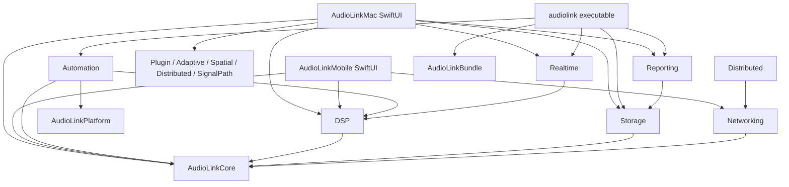

# AudioLink Lab architecture review

Review date: 2026-08-05  
Review scope: repository state after the Prompt 26 audit fixes  
Reviewer posture: implementation and documentation claims were treated as hypotheses and checked against manifests, imports, call sites, tests, and scripts.

## Executive assessment

The package boundaries are real enough to continue maintaining the core offline
workflow. The DSP, storage, networking, reporting, and mobile-host code are
independently buildable and the new boundary script prevents several common
back-edges. The project is not yet a coherent implementation of every feature
named in its roadmap: plugin isolation, a fully executable module registry, a
single GUI/CLI use-case, complete HAL event coverage, and production hardware
validation are still absent or partial.

No new Critical defect was found after the fixes below. There are still High
risks, so this review does **not** certify v2.0-ready or production-grade
hardware/plugin operation.

## Real project map

The repository contains two executable SwiftPM app targets and fourteen package
targets. There is no Xcode project, XPC service, helper executable, or plugin
helper target in the repository.



### Confirmed flows

- File analysis: SwiftUI `LiveNewMeasurementService` imports WAV/AVFoundation
  audio, applies explicit preprocessing, runs quality-aware correlation, then
  persists through the injected `MeasurementRepository`. The CLI's
  `HeadlessFileAnalyzer` uses the same importer and correlation engine but a
  smaller configuration/result path.
- Real-time audio: `RealtimeMeasurementEngine` coordinates the injected device
  service, permission authorizer, `AVAudioEngineRealtimeController`, and
  history saver. The input tap owns a bounded preallocated capture buffer; the
  actor materializes PCM after the tap is removed.
- Persistence: `SQLiteMeasurementRepository` is an actor over SQLite WAL and
  migration tables. The older `MeasurementSessionStore` compatibility API now
  writes versioned opaque records into the same database's `lab_artifacts`
  table via `SQLiteMeasurementSessionStore`.
- Network: Bonjour/discovery and protocol state are in
  `AudioLinkNetworking`; simulated in-memory transport is what the automated
  tests exercise. The local automation API is an optional loopback-only
  `NWListener`, separate from LAN peer protocol.
- Reports and bundles: report builders convert storage values into a public
  `ReportDocument`; bundle creation/validation operates on a manifest and file
  checksums, not SQLite internals.

## Documentation claim audit

| Claim | Status | Evidence and qualification |
|---|---|---|
| DSP is decoupled from SwiftUI | **verified** | `AudioLinkDSP` imports Core/Apple frameworks only; `Scripts/check-architecture.sh` enforces this. |
| Core has no UI/storage dependency | **verified** | Core source imports Foundation only; architecture check covers the boundary. |
| Networking has no SwiftUI/app dependency | **verified** | Networking imports Core/Network/CryptoKit only; architecture check covers it. |
| GUI, CLI, and automation share one execution core | **partially verified** | They share importer/correlation packages. GUI preprocessing/quality orchestration is in `Apps/AudioLinkMac/NewMeasurementService.swift`; CLI orchestration is `HeadlessFileAnalyzer`, so advanced options and result mapping differ. |
| Database schema is independent from bundle/report schemas | **verified** | Bundle no longer depends on Storage; `ReportDocument` is a separate Codable model and conversion is confined to reporting adapters. |
| Third-party plugins are isolated in a helper process | **contradicted** | `AudioLinkPlugin` has no helper/XPC/process target; `AudioUnitProfiler` runs an injected async runner in-process. Mocks model crash/timeout but do not provide process isolation. |
| Every built-in module executes through `MeasurementModule` | **partially verified** | `AudioLinkPlatform` provides descriptors, `AnyMeasurementModule`, and a queue. `BuiltInMeasurementModules` currently publishes descriptors only; app feature services are not registered adapters. |
| All tasks support cancellation | **partially verified** | File/DSP/realtime/queue paths check cancellation. Network receive, some report/file operations, and plugin isolation are not a single cancellable execution contract. |
| Device resources are globally exclusive | **partially verified** | `MeasurementJobQueue` locks declared resource keys. Legacy app paths and direct realtime view-model calls do not all go through that queue. |
| Permissions are requested on demand | **partially verified** | Realtime microphone permission is requested at measurement start and iOS uses a role-specific adapter. A future module registry does not yet centralize permission declarations/enforcement. |
| History survives restart and migrates | **verified for SQLite paths** | Repository migration/rollback tests pass; compatibility sessions now use SQLite-backed artifacts and have a restart test. A legacy artifact remains a separate model from relational history. |
| Reports default to privacy-safe output | **verified** | Report privacy tests and bundle anonymization tests pass; paths/bookmarks are excluded by default. |
| Distributed results include uncertainty | **verified at model/test level** | Distributed package contains uncertainty budget and clock model tests; multi-device hardware scale remains unverified. |
| Core Audio changes are listener-driven | **partially verified** | `AudioDeviceProfiler` registers/removes HAL listeners. `SystemAudioDeviceService.events()` used by realtime measurement still polls snapshots, and therefore does not expose the full profiler event set. |
| Version provenance is independently traceable | **partially verified** | Core release metadata separates app/build/algorithm/database/etc., while protocol/report/bundle/automation/platform types also carry their own constants. Not every feature result is wrapped in `MeasurementResultEnvelope`, and some schema defaults are duplicated. |
| CLI JSON stdout is machine-only | **verified by CLI tests/smoke** | CLI paths encode JSON to stdout and send diagnostics to stderr; smoke tests cover help, signal generation, analysis, and bundle validation. |

## Findings by severity

### Critical

No unresolved Critical finding was confirmed in the audited code after the
changes in this review. This is not a statement that physical devices,
third-party plugins, or an unencrypted LAN are safe for every threat model.

### High

1. **Plugin process isolation is absent** — `Packages/AudioLinkPlugin/Sources/AudioLinkPlugin/AudioUnitProfiler.swift` and `AudioUnitPluginModels.swift` (not fixed this round). A crashing or hanging third-party AU still executes through an in-process runner. Trigger: profile an untrusted AU or replace the mock runner with a real component. Risk: main app crash, UI hang, global plugin state, or unauthorized side effects. Required fix: separate signed helper executable/XPC boundary, watchdog, crash quarantine, and explicit entitlements. The present timeout is useful for injected mocks but is not isolation.
2. **The common module protocol is descriptive, not executable** — `BuiltInMeasurementModules.descriptors` and `MeasurementJobQueue` (not fixed). Trigger: submit a descriptor without an adapter. Risk: a UI/CLI can report a module as available while no implementation is registered. Required fix: registry-backed adapters with capability checks and integration tests for each module.
3. **GUI and CLI have divergent analysis semantics** — `LiveNewMeasurementService` versus `HeadlessFileAnalyzer` (not fixed). Trigger: use GUI DC removal/high-pass/resampling/quality settings and compare with CLI output. Risk: non-reproducible results and misleading automation comparisons. Required fix: extract a package-level file-analysis use case and have both front ends map to it; preserve CLI schema with additive fields.
4. **Realtime and profiler device event coverage is split** — `SystemAudioDeviceService.events()` polls once per second while `AudioDeviceProfiler` owns the richer HAL listener path (not fixed). Trigger: rapid buffer/format/clock changes during a live measurement. Risk: stale route validation or delayed cancellation. Required fix: inject one coalescing HAL event source into realtime and profiler, with callback work limited to scheduling actor refreshes.
5. **LAN transport is framed and paired but not encrypted** — `NetworkPeerTransport` and `PROTOCOL.md` (not fixed; documented boundary). Trigger: hostile or compromised local network. Risk: confidentiality/integrity is not equivalent to TLS. Required fix: authenticated TLS or an explicitly reviewed local IPC boundary before claiming secure transport. Current user pairing and replay checks do not provide encryption.
6. **Resource locking is opt-in** — `MeasurementJobQueue` only locks keys supplied by callers (not fixed). Trigger: direct GUI realtime calls overlap a queued lab job or two paths use different key strings for one device. Risk: simultaneous hardware access despite the queue's guarantee. Required fix: a composition-root resource-key provider and route/device identity normalization.

### Medium

1. **The macOS app remains a 3,847-line composition/UI file** —
   `Apps/AudioLinkMac/Sources/AudioLinkMac/AudioLinkLabApp.swift`. It contains
   legacy dashboard state, record DTOs, CSV formatting, settings, and views.
   Risk: lifecycle and schema behavior are hard to test. Deferred because a
   split would touch navigation and persistence behavior without a focused
   migration.
2. **Two history model families remain** — `MeasurementSession`/
   `MeasurementSessionStore` and `MeasurementHistorySession`/
   `MeasurementRepository`. The compatibility store is now durable, but the
   old dashboard and new History page still do not present one unified query
   model. Risk: records can be visible in one surface and absent from another.
   Deferred pending an additive relational representation for failed legacy
   runs and their `MeasurementError`.
3. **`@unchecked Sendable` is used at several platform boundaries** — network
   objects, SQLite connection, capture accumulators, signal converter/FFT
   caches, and UI callback relays. Most have locks or actor ownership, but the
   compiler cannot verify those invariants. Deferred broad replacement; the
   realtime capture accumulator was hardened locally with a scoped lock.
4. **Reporting intentionally depends on Storage for conversion** —
   `AudioLinkReporting/ReportDocumentBuilder.swift`. This is not a schema leak
   because `ReportModels.swift` no longer imports Storage, but a future split
   could move the conversion adapter to the app/composition layer.
5. **Automation HTTP parsing is minimal** — `LocalAutomationServer` parses one
   bounded receive into an HTTP request and does not implement a full streaming
   HTTP parser. Risk: fragmented requests and unusual headers are rejected or
   misread. The server is opt-in and localhost-only; a full parser is deferred.
6. **Benchmark coverage is a harness, not a cross-platform performance gate** —
   `Benchmarks/AudioLinkBenchmarks` now participates in `Scripts/build-all.sh`,
   but hardware CPU/memory baselines remain manually collected.

### Low

- Naming and file organization in the macOS legacy surface are inconsistent.
- Some package manifests retain broad package-level dependencies for tests even
  when executable target dependencies were narrowed.
- A few version defaults are duplicated in package-local models; these are
  compatibility-sensitive and should be consolidated only with migration tests.

## Repairs completed in this review

- Added a lock-protected, one-shot playback completion gate. Cancelling
  `AVAudioPlayerNode` playback now resolves the waiting task even if Apple does
  not deliver a completion callback; double callback/cancellation cannot
  resume the continuation twice. Added two regression tests.
- Added a lock around the realtime capture accumulator's bounded storage and
  snapshot. Audio tap callbacks can no longer race `stopRecording()` while the
  captured PCM and counters are being materialized.
- Added a one-shot Network.framework continuation gate and cancellation cleanup.
  Failed, cancelled, and ready state callbacks cannot double-resume; timeout
  now cancels the connection so it cannot become ready after the caller has
  moved on.
- Replaced the live macOS compatibility `InMemoryMeasurementSessionStore` with
  `SQLiteMeasurementSessionStore`, an opaque `lab_artifacts` adapter with its
  own payload version. Added persistence/restart/delete coverage.
- Hardened automation allow-list checks against symlink escapes and bounded
  terminal job history to 100 records. Added a symlink regression test.
- Fixed a report PNG artifact naming bug and added an assertion for the emitted
  chart filename.
- Removed unused Core dependencies from the Bundle and Platform packages,
  narrowed the Automation library target dependencies, and narrowed mobile/mac
  executable target dependencies to imports actually used.
- Added `Scripts/check-architecture.sh` and a CI job enforcing the import
  direction (Core/DSP/Storage/Networking/CLI and report-schema boundaries).
- Added benchmark executable compilation to `Scripts/build-all.sh` and
  corrected README/Architecture claims that were contradicted by the actual
  mobile and CLI target graphs.

## Invalid or ineffective abstractions

No public protocol was deleted in this pass: the remaining protocols are used
for hardware/mock injection or cross-package boundaries. The following are
identified for a future focused change rather than removed speculatively:

- `FoundationMeasurementPerformer` is a legacy compatibility implementation
  that deliberately reports “not connected to hardware”; it should be removed
  only when the old dashboard route is migrated to the realtime runner.
- `BuiltInMeasurementModules` descriptors are not dead code, but they are not
  executable registrations yet; deleting them would hide the missing adapter
  problem rather than solve it.
- `InMemoryMeasurementSessionStore` remains useful for tests. It is no longer
  used by the live composition root.

## Boundary checks added

`Scripts/check-architecture.sh` checks actual Swift import declarations and
fails CI if:

- Core imports UI, DSP, Storage, Networking, Realtime, or Reporting.
- DSP imports UI, Storage, Networking, Realtime, or Reporting.
- Networking imports UI, app targets, Storage, Reporting, or Realtime.
- Storage imports UI, Reporting, or app targets.
- CLI source imports SwiftUI or an app target.
- Shared packages import an app target.
- `ReportModels.swift` imports Storage.

It is deliberately a lightweight guardrail, not a substitute for Swift type
checking. The script passed locally in this review.

## Compatibility status

- SQLite schema remains version 5; no migration was changed. The compatibility
  session payload is additive in the existing `lab_artifacts` table.
- Report, bundle, protocol, automation, and module schema values were not
  changed.
- CLI arguments and JSON result fields were not removed.
- Network wire messages were not changed; only the native transport's failure
  cleanup was hardened.
- The playback/capture fixes are internal behavior changes that make
  cancellation safer and do not alter successful result semantics.

## Verification

Commands run during this review:

```text
bash Scripts/check-architecture.sh                         PASS
Scripts/test-packages.sh                                   PASS (227 package/mobile tests)
swift test --package-path Packages/AudioLinkRealtime ...    PASS (42, focused)
swift test --package-path Packages/AudioLinkStorage ...     PASS (20, focused)
swift test --package-path Packages/AudioLinkNetworking ...  PASS (10, focused)
swift test --package-path Apps/AudioLinkMac ...             PASS (22)
Scripts/build-all.sh                                       PASS (all packages, macOS, mobile host, benchmarks)
swift package clean --package-path Apps/AudioLinkMac
swift build --package-path Apps/AudioLinkMac -Xswiftc -warnings-as-errors  PASS (clean macOS build)
IOS_SDK="$(xcrun --sdk iphonesimulator --show-sdk-path)"; IOS_VERSION="$(xcrun --sdk iphonesimulator --show-sdk-platform-version)"; swift build --package-path Apps/AudioLinkMobile --sdk "$IOS_SDK" --triple "arm64-apple-ios${IOS_VERSION}-simulator" -Xswiftc -warnings-as-errors  PASS with Xcode sysroot warning
CLI generate-signal/analyze-files/validate                PASS (self WAV + anonymous bundle)
```

The Python/SciPy validation corpus and physical-device checks remain separate
from this local build matrix; no physical device or third-party plugin helper
was available.

Not verified on the current machine:

- physical Core Audio hot-plug, buffer/format event timing, device restoration;
- third-party AU crash/hang isolation (there is no helper process yet);
- signed/notarized macOS distribution and App Store iOS build;
- real two-device network timing, TLS threat resistance, and 5+ node scale;
- DAW, spatial room, USB, Bluetooth, aggregate, and virtual-loopback behavior.

## Next round

1. Extract a package-level file-analysis use case shared by GUI, CLI, and local
   automation, with an additive result schema and parity fixtures.
2. Implement a real helper executable/XPC boundary for Audio Units before
   enabling third-party profiling.
3. Register executable adapters for each `MeasurementModule` descriptor and
   route all front ends through the job/resource executor.
4. Replace realtime polling with the coalescing HAL event stream and add manual
   hardware tests for route changes and restoration.
5. Migrate legacy `MeasurementSession` records into relational history or make
   the old dashboard read the same repository query model.

**Maintenance judgment:** the core package architecture is suitable for
continued development, but the product-level architecture is not yet unified
enough to claim that every advertised lab feature is production-ready. The
highest-value work is convergence and isolation, not another feature layer.
