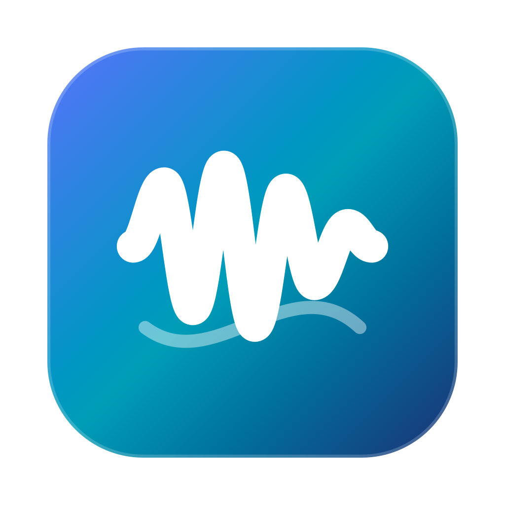

# AudioLink Lab


AudioLink Lab is a native Apple-platform toolkit for measuring end-to-end audio
latency, jitter, clock drift, correlation confidence, and complex audio paths.
It combines a macOS SwiftUI application, an iOS companion, independently
buildable Swift packages, deterministic DSP, local history, CLI automation, and
privacy-aware reports.

<p align="center">
  
</p>

## Features

- Import and compare reference/recording WAV files with typed sample units
- Generate logarithmic and linear sweeps, chirps, MLS, impulse, silence, and deterministic noise
- Decode PCM 16/24/32-bit and IEEE Float32 WAV into planar Float32 audio
- Apply explicit channel selection, downmixing, DC removal, normalization, trimming, filtering, resampling, and polarity changes
- Estimate delay with direct or Accelerate FFT cross-correlation, signed peaks, search ranges, and fractional interpolation
- Explain confidence with peak ambiguity, SNR, clipping, truncation, channel disagreement, and signal-quality diagnostics
- Inspect waveforms, correlation plots, peak neighborhoods, candidates, and processing logs
- Save results to privacy-first SQLite history, search and compare runs, and preserve algorithm provenance
- Run same-Mac real-time loopback measurements with Core Audio device selection and bounded capture buffers
- Repeat measurements and calculate robust statistics, percentiles, jitter definitions, outliers, and drift
- Profile Core Audio capabilities, audio interfaces, signal paths, spatial IRs, and distributed measurement plans
- Export JSON, CSV, HTML, PDF, PNG, and `.audiolinkbundle` artifacts without raw audio by default
- Use the standalone `audiolink` CLI and optional loopback-only localhost automation API
- Share Core, DSP, networking, and measurement models with the native iOS companion

Advanced device, plugin, DAW, and distributed modules are available as
foundations and adapters. Hardware behavior, third-party plugin isolation, and
hostile-LAN security require the manual validation described in the
documentation; they are not silently presented as certified capabilities.

## Requirements

### Latest Version

- Apple Silicon or Intel Mac
- Runtime requirement: macOS 13+
- iOS companion target: iOS 16+
- Xcode 16+ and Swift 6
- No third-party runtime dependencies; Apple frameworks include SwiftUI,
  Accelerate, AVFoundation, AudioToolbox, Network.framework, and SQLite3

## Build

Run the package and host test matrix:

```bash
./Scripts/test-packages.sh
swift test --package-path Apps/AudioLinkMac -Xswiftc -warnings-as-errors
swift test --package-path Apps/AudioLinkMobile -Xswiftc -warnings-as-errors
./Scripts/build-all.sh
```

The iOS companion can be compiled for the simulator without a signing team:

```bash
IOS_SDK="$(xcrun --sdk iphonesimulator --show-sdk-path)"
IOS_VERSION="$(xcrun --sdk iphonesimulator --show-sdk-platform-version)"
swift build --package-path Apps/AudioLinkMobile --sdk "$IOS_SDK" \
  --triple "arm64-apple-ios${IOS_VERSION}-simulator" \
  -Xswiftc -warnings-as-errors
```

## Run

Launch the macOS application:

```bash
swift run --package-path Apps/AudioLinkMac AudioLinkMac
```

Run the CLI:

```bash
swift run --package-path Packages/AudioLinkAutomation audiolink --help
swift run --package-path Packages/AudioLinkAutomation audiolink \
  analyze-files --reference reference.wav --recording recording.wav --json
```

Generate a deterministic test signal:

```bash
swift run --package-path Packages/AudioLinkAutomation audiolink \
  generate-signal --output sweep.wav --sample-rate 48000 --duration 2 --json
```

## Package

Create an ad-hoc macOS `.app` bundle:

```bash
AUDIO_LINK_VERSION=1.0.0 AUDIO_LINK_BUILD_VERSION=1 \
  ./Scripts/package-app.sh release
open "dist/AudioLink-Lab-v1.0.0-macOS-universal.app"
```

Create the complete release artifact set:

```bash
AUDIO_LINK_VERSION=1.0.0 AUDIO_LINK_BUILD_VERSION=1 \
  ./Scripts/release.sh --skip-validation
```

The release script writes flat, versioned artifacts directly under `dist/`:
the macOS universal `.app`, `.zip`, and `.dmg`, the universal CLI, optional iOS
companion simulator archive, source archive, SHA-256 files, and a release
manifest. Developer ID signing, notarization, and App Store distribution
require the developer's own credentials and are never represented as complete
by this repository.

## Architecture

```text
Apps/AudioLinkMac             Native macOS SwiftUI application
Apps/AudioLinkMobile          Native iOS companion and AVAudioSession bridge
Packages/AudioLinkCore        Domain models, units, errors, release metadata
Packages/AudioLinkDSP         Signals, PCM, import, preprocessing, correlation
Packages/AudioLinkRealtime    Core Audio devices, engine, capture, statistics
Packages/AudioLinkStorage     SQLite history, migrations, lab artifacts
Packages/AudioLinkNetworking  Bonjour, pairing, protocol, transfer, clocks
Packages/AudioLinkReporting   Versioned JSON/CSV/HTML/PDF/PNG reports
Packages/AudioLinkAutomation  CLI, headless analysis, localhost API
Packages/AudioLinkBundle      Checksummed privacy-aware bundle format
Packages/AudioLinkPlatform    Module descriptors, result envelope, job queue
Packages/AudioLinkAdaptive    Probe-driven measurement planning
Packages/AudioLinkSpatial     Spatial impulse-response analysis
Packages/AudioLinkDistributed Multi-node coordination and uncertainty
Packages/AudioLinkPlugin      Audio Unit profiling abstractions
Packages/AudioLinkSignalPath  DAW and virtual-route marker analysis
Benchmarks/                   Performance harnesses and baselines
Validation/                   Python reference and blind DSP validation
Documentation/               Architecture, algorithms, security, and usage
assets/screenshots/           Screenshot placeholders and UI captures
dist/                         Ignored, flat local release artifacts
```

All shared packages are independent Swift packages. SwiftUI does not contain
the DSP or persistence algorithms, and the CLI uses the same importer and
correlation engine as the macOS workflow.

## Window and motion behavior

The macOS app opens at 1180 × 820 points and enforces a 1100 × 760 point
minimum so the sidebar, measurement controls, and chart labels remain usable.
Within that boundary, file cards, route controls, history panels, statistics,
and paired charts switch between horizontal and stacked layouts as space
changes. Long pages scroll vertically rather than compressing controls below a
readable size.

Page direction, spring timing, component entrances, pressed states, and panel
hover treatment use the same source motion baseline as the Latency Graph shell.
Moving forward through a segmented workflow enters from below; moving backward
enters from above. Enhanced, Reduced, and Off motion preferences, together with
the macOS Reduce Motion setting, remain authoritative.

## Analyze two WAV files

The first production workflow compares an exported reference signal with a
recording containing the same signal:

1. Open **New Measurement** in the sidebar.
2. Choose or drop a supported **Reference WAV**.
3. Choose or drop the **Recording WAV**.
4. Keep the defaults for a normal loopback measurement, or configure channels,
   polarity, delay range, normalization, DC removal, high-pass filtering,
   resampling, and correlation implementation.
5. Select **Analyze** or press **Command-Return**. Import and DSP work run away
   from the main actor; **Cancel** remains available while work is running.
6. Review millisecond and sample delay, fractional estimate, correlation,
   polarity, quality, warnings, and recommended next action. Use **Copy Result**
   for a structured text summary.
7. Open **Waveforms** to compare split reference/recording tracks before or
   after delay alignment. Open **Correlation** to inspect signed peaks, the
   search range, candidates, and fractional interpolation. Use **Copy Chart**
   or **Export PNG** for a path-free visual record.

The **Diagnostics** and **Processing Log** sections explain the quality result
and list every explicitly applied audio transformation.

Supported baseline WAV input is mono or stereo PCM 16/24/32-bit and IEEE
Float32. AIFF, CAF, and M4A are capability-dependent AVFoundation fallbacks and
must not be treated as the tested WAV baseline. Import has bounded decoded-frame
and byte limits.

## Real-time measurement

1. Open **New Measurement** and choose **Real-time**.
2. Refresh Core Audio devices, then choose an output, an input, and their
   physical channels. System defaults are labeled.
3. Lower playback volume and confirm the safety notices. AudioLink never routes
   the input tap back to its output mixer, but external routing can still cause
   acoustic feedback.
4. Optionally select **Preview Sweep**. Preview does not request microphone
   access.
5. Select **Start Real-time Measurement** or press **Command-Return**.
   Recording starts before pre-roll and playback scheduling.
6. Stop with **Stop** or Escape. Device removal or a selected endpoint sample
   rate change stops the measurement safely.

The final delay is obtained from recording correlation, not software scheduling
timestamps. Engine start, host/sample times, buffer counts, dropped buffers,
route changes, and nominal formats remain diagnostics.

## Repeated measurements, calibration, and drift

Repeated measurement plans support warm-up runs, intervals, finite retries,
pause/resume, cancellation, failure policies, and independent run persistence.
Statistics include minimum, maximum, mean, median, P50/P90/P95/P99, variance,
standard deviation, MAD, IQR, peak-to-peak spread, and quality distribution.
The report names each jitter definition; failed and marked-outlier runs are not
silently deleted.

Calibration profiles preserve raw delay and derive calibrated delay only when
the device, channels, sample rate, buffer, and profile method match. Clock drift
uses repeated event positions and a linear fit in ppm, with residuals,
observation quality, missing events, discontinuities, and nonlinear warnings.

## History, reports, and bundles

Completed analysis defaults to results-only local SQLite history. It retains
sanitized metadata, configuration, diagnostics, quality, and correlation plot
data, but no absolute path, permissions, bookmark, or raw audio. Users may
explicitly select bookmarks, managed audio copies, or no history. History can be
searched, filtered, compared, exported, and deleted with confirmation.

Reports include JSON, CSV, HTML, PDF, and PNG output with explicit units,
algorithm/app versions, processing logs, calibration, drift, quality, and
reproducibility information. `.audiolinkbundle` is a directory package with a
versioned manifest, SHA-256 inventory, size limits, and optional content. Raw
audio is excluded unless explicitly selected.

## Device, plugin, DAW, spatial, and distributed labs

The repository also contains foundations for the following advanced workflows:

- **Device Lab** reads Core Audio capabilities, streams, channel labels, clock,
  buffer, latency, controls, aggregate-device state, and snapshot differences.
- **Interface Benchmark Lab** builds sample-rate/buffer matrices and separates
  reported, theoretical, and measured latency while preserving configuration
  restoration warnings.
- **Plugin Lab** models Audio Unit discovery, reported versus measured latency,
  frequency/phase response, group delay, THD, noise, tail, and CPU metrics.
  Third-party plugin process isolation is not yet complete.
- **Signal Path** supports continuous capture, scheduled windows, repeated
  markers, offline round trips, DAW/virtual-device descriptions, and path
  comparison without pretending to control every DAW internally.
- **Adaptive Planner** chooses signals, durations, search windows, repetitions,
  and bounded retries from probe evidence while respecting user locks.
- **Spatial Mapper** records source/receiver coordinates, impulse responses,
  validity-aware decay and clarity metrics, and sparse heat-map data.
- **Distributed Measurement** coordinates star-topology nodes, readiness,
  per-node clock observations, failure policy, and uncertainty budgets. Network
  timing remains diagnostic; acoustic correlation is authoritative.

These modules are intentionally explicit about hardware requirements and
unverified behavior. They are not acoustic certification, plugin-sandbox, or
hostile-network guarantees.

## CLI and automation

The standalone `audiolink` executable supports signal generation, file analysis,
device inspection, drift estimation, report export, history, validation, and
versioned batch plans. JSON mode keeps stdout machine-readable and sends
diagnostics to stderr. Hardware/plugin commands return an explicit unsupported
status until the required adapter is available.

The optional local automation service is disabled by default, binds only to
loopback, requires a random token, limits request size and concurrency, and
accepts files only from explicitly allowed directories. See
[`Documentation/DeveloperAndValidation.md`](Documentation/DeveloperAndValidation.md)
and [`Documentation/SecurityAndData.md`](Documentation/SecurityAndData.md).

## Validation and development references

The project includes deterministic examples and an independent Python
reference implementation. The validation corpus covers integer/fractional
delay, gain, polarity, white/pink noise, clipping, echoes, truncation, drift,
periodic ambiguity, stereo mismatch, long silence, and high sample rates.

Relevant documents are grouped into a small set of maintained references:

- [`Documentation/UserGuide.md`](Documentation/UserGuide.md) for installation,
  first use, workflows, history, reports, troubleshooting, and limitations
- [`Documentation/MeasurementReference.md`](Documentation/MeasurementReference.md)
  for signals, import, correlation, quality, calibration, visualization, and
  spatial/adaptive measurement
- [`Documentation/PlatformAndLabs.md`](Documentation/PlatformAndLabs.md) for
  realtime audio, Core Audio, devices, plugins, networking, and advanced labs
- [`Documentation/SecurityAndData.md`](Documentation/SecurityAndData.md) for
  privacy, protocol, bundles, automation, and security boundaries
- [`Documentation/DeveloperAndValidation.md`](Documentation/DeveloperAndValidation.md)
  for CLI, validation, release, and engineering references
- `Documentation/Reviews/ARCHITECTURE_REVIEW.md`,
  `Documentation/Reviews/DSP_VALIDATION_REVIEW.md`, and
  `Documentation/Reviews/RELIABILITY_SECURITY_REVIEW.md` for audit evidence

## Data and privacy

Completed measurements default to a results-only local SQLite policy. Absolute
paths, raw audio, security-scoped bookmarks, and unnecessary device identifiers
are not exported by default. Raw recordings are opt-in. Reports and bundles
offer minimal, standard, and strict anonymization levels, but free-form notes
still require human review.

The LAN protocol requires explicit pairing and has size, replay, and checksum
guards, but it is not TLS-authenticated. Use it only on a trusted local
network. Unknown third-party Audio Units should not be loaded until helper
process isolation is implemented and validated.

## Validation and limitations

The independent validation tools are in `Validation/`:

```bash
python3 -m pip install -r Validation/requirements.txt
python3 Validation/run_validation.py --workspace . --profile quick
```

Current release limitations include unverified physical Core Audio route
recovery, real iOS interruption/background behavior, hostile-LAN resistance,
third-party plugin crash isolation, and hardware soak testing. See
[`Documentation/UserGuide.md`](Documentation/UserGuide.md),
[`Documentation/SecurityAndData.md`](Documentation/SecurityAndData.md), and
`Documentation/Reviews/RELIABILITY_SECURITY_REVIEW.md` before distribution.

## Release

Download the v1.0.0 package from [GitHub Releases](https://github.com/HanBangyuan8/AudioLink-Lab/releases).

Release notes and the version history are maintained in
[CHANGELOG.md](CHANGELOG.md). The current source release metadata is
centralized in `AudioLinkReleaseMetadata`; app, algorithm, protocol, report,
bundle, automation, and database versions are independent.

## License

MPL-2.0. See [LICENSE](LICENSE).

## Star History

<a href="https://www.star-history.com/?type=date&repos=HanBangyuan8%2FAudioLink-Lab">
 <picture>
   <source media="(prefers-color-scheme: dark)" srcset="https://api.star-history.com/chart?repos=HanBangyuan8/AudioLink-Lab&type=date&theme=dark&legend=top-left" />
   <source media="(prefers-color-scheme: light)" srcset="https://api.star-history.com/chart?repos=HanBangyuan8/AudioLink-Lab&type=date&legend=top-left" />
   
 </picture>
</a>
